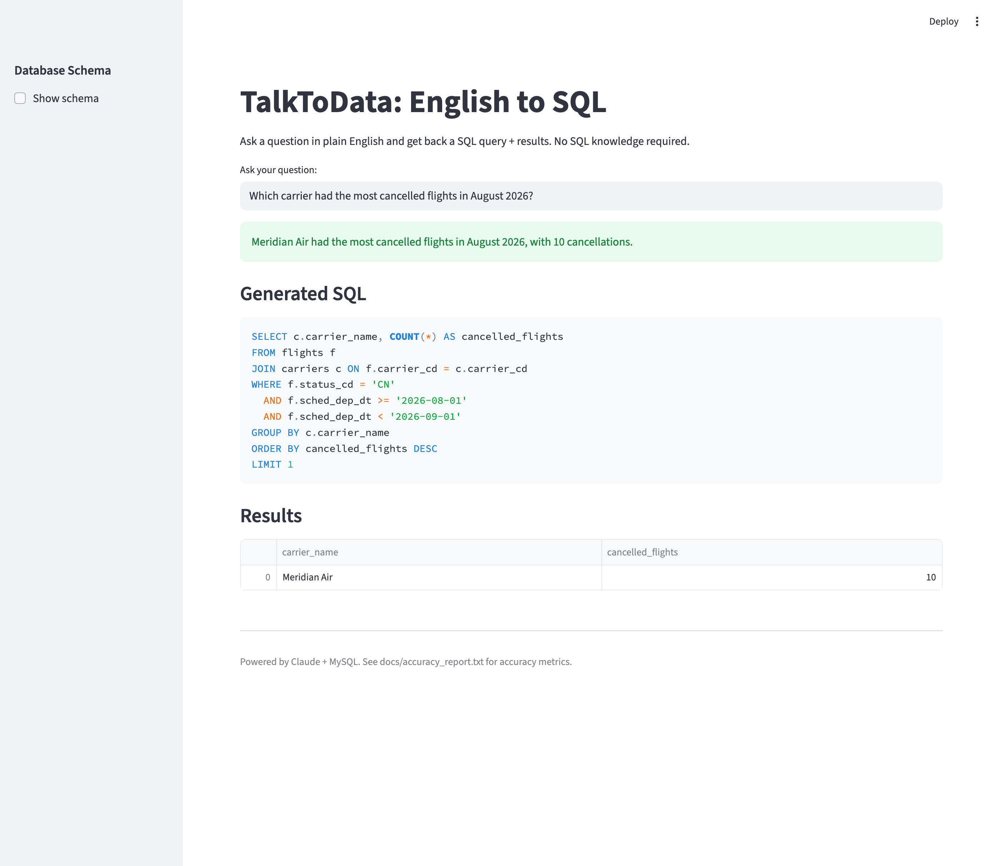

# TalkToData: English to SQL

[](https://github.com/thaenandarhtet-iris/talktodata-text-to-sql-assistant/actions/workflows/tests.yml)
[](LICENSE)

Type a question in plain English and get back a SQL query plus the answer. TalkToData uses Claude to turn the question into a MySQL `SELECT`, checks that the query is read-only, runs it, and shows both the SQL and the result table in a Streamlit app.



The sample database is a fictional airline with 6 carriers, 20 airports, 50 aircraft, 4,000 flights, 2,500 passengers and 11,583 bookings.

## How it works

1. **Schema introspection:** reads tables, columns and foreign keys from `INFORMATION_SCHEMA` at runtime, so the prompt always matches the live database.
2. **Prompt building:** adds `schema_hints.yaml`, which explains coded columns (for example `status_cd`: `DL` = delayed), because the model otherwise writes `'Delayed'` and matches nothing.
3. **SQL generation:** Claude writes a single `SELECT` statement.
4. **Safety check:** `src/safety.py` rejects anything that is not a single `SELECT` (see [Safety](#safety)).
5. **Self-correction:** if the query fails the safety check or MySQL returns an error, the error is sent back to Claude for one retry.
6. **Execution:** runs as a read-only database user with a 5-second timeout and shows up to 1,000 rows.
7. **Plain-English answer:** Claude turns the result into a one- or two-sentence answer (codes translated into words) shown above the SQL.

Questions can be shared as links: `http://localhost:8501/?q=How many flights were delayed?`

## Accuracy

Accuracy is measured on 25 hand-written questions (`tests/gold_sql.yaml`): five each of lookup, filter, join, aggregation and date range. A question counts as correct when the generated SQL returns the same rows as the gold answer. Row order and column names don't matter, extra columns are allowed, and numbers are compared to 2 decimal places. Each question gets one attempt with no retry, so this is stricter than the app, which retries once.

| Prompt | Runs | Accuracy |
|---|---|---|
| Schema + `schema_hints.yaml` | 4 | **100%** (25/25) on every run |
| Schema only (ablation) | 3 | 80–84% (20–21/25) |

Measured with `claude-sonnet-5` on 2026-09-28. Full reports with the failing SQL: [with hints](docs/accuracy_report.txt), [without hints](docs/accuracy_report_no_hints.txt).

**What the evaluation showed**

- **Coded values are the main failure mode.** Without hints, every miss came from the model guessing a code: `'CX'` for cancelled flights (flights use `'CN'`; `CX` is for bookings), `'CO'` for confirmed bookings (it's `'CF'`), and `'B'` for business class (it's `'J'`). The hints file fixes all of these.
- **Codes vs names.** Before one prompt rule was added, the model scored 88–96% with hints. The misses answered "which carrier…" with `MD` instead of "Meridian Air". Adding one instruction to return the readable name column fixed this on every later run.
- **The answer key is tested too.** `tests/test_eval.py` runs every gold query against the database. This caught a stale answer (5,000 flights instead of 4,000). It also caught questions that used `LIMIT` without `ORDER BY`, which no correct answer could reliably match. Both were fixed.

**Caveats.** Twenty-five questions on a 6-table schema, written by the same person who wrote the prompt, is a small and fairly easy test. 100% here means the pipeline handles this schema's common question types, not that it would score the same on an independent benchmark such as Spider or BIRD. That would be the next step.

```bash
python -m src.evaluation --save              # with hints -> docs/accuracy_report.txt
python -m src.evaluation --no-hints --save   # ablation   -> docs/accuracy_report_no_hints.txt
```

## Safety

The app is read-only, enforced at two layers:

- **Database:** the app connects as `talktodata_ro`, which only has `SELECT` on the `talktodata` schema (`data/readonly_user.sql`). Even a query that passed the checks below could not change data.
- **Query check:** before running anything, `validate_sql` removes string literals and comments, then requires exactly one statement starting with `SELECT`. It blocks write and DDL keywords, `UNION`, `INTO OUTFILE`/`DUMPFILE`, and `SLEEP`/`BENCHMARK`.

The keyword check is a guardrail, not a SQL parser. The read-only user is what actually guarantees the data can't be changed.

## Tech stack

- **Claude API** (`claude-sonnet-5`) for SQL generation
- **MySQL 8.0** in Docker, seeded from `data/seed.sql`
- **Python 3.11:** anthropic, mysql-connector-python, pandas, PyYAML
- **Streamlit** for the web UI
- **pytest** and **GitHub Actions** for tests

## Quick start

Prerequisites: Docker, Python 3.11+, and an Anthropic API key.

```bash
pip install -r requirements.txt
cp .env.example .env          # then set ANTHROPIC_API_KEY
docker compose up -d          # MySQL on localhost:3307; first start takes ~30s
python -m scripts.check_db    # prints flight counts by status
streamlit run app.py          # opens http://localhost:8501
```

## Tests

```bash
pytest
```

- `test_safety.py` and the comparison and SQL-extraction tests run anywhere, and CI runs them on every push.
- Tests that need the database skip themselves unless MySQL is running.
- Tests that call Claude also need `ANTHROPIC_API_KEY`.
- `test_eval.py` checks that every gold query returns its expected result, so the answer key itself is verified.

## Project structure

```
app.py                     Streamlit UI
src/
  config.py                Settings from .env (DB, model, timeout)
  schema_introspection.py  DB connection and live schema discovery
  sql_generator.py         Prompt building, SQL generation, retry loop, answer summary
  safety.py                Read-only query validation
  executor.py              Query execution and result comparison
  evaluation.py            Accuracy evaluation against the gold set
scripts/check_db.py        Database connection check
tests/                     pytest suite and gold_sql.yaml
data/
  seed.sql                 Schema and sample data
  readonly_user.sql        SELECT-only app user
schema_hints.yaml          Meanings of coded columns
docs/                      Accuracy reports, scope and screenshot
```

## Example

"How much revenue did each loyalty tier generate?"

```sql
SELECT p.loyalty_tier, SUM(b.fare_amt) AS revenue
FROM passengers p
JOIN bookings b ON p.pax_id = b.pax_id
WHERE b.status_cd = 'CF'
GROUP BY p.loyalty_tier
ORDER BY revenue DESC
```

## Scope and limitations

See [`docs/SCOPE.md`](docs/SCOPE.md). In short:

- MySQL only.
- Single-turn questions (no follow-ups).
- No CTEs, `UNION` or window functions.
- The whole schema goes into every prompt, which works for this 6-table database but would need schema selection for large ones.

Possible next steps:

- Evaluate on an independent benchmark (Spider or BIRD) and add harder questions (subqueries, ratios, ties).
- Add few-shot examples.
- Support multi-turn follow-ups.
- Add a Postgres connector.

## Troubleshooting

- **Port 3307 already in use:** change the host port in `docker-compose.yml` and `DB_PORT` in `.env`.
- **Access denied for `talktodata_ro`:** the read-only user is created only when the database volume is first initialized. Recreate it with `docker compose down -v && docker compose up -d`.
- **Connection refused right after startup:** MySQL takes about 30 seconds to initialize. Check with `docker compose ps`.

## License

[MIT](LICENSE)
